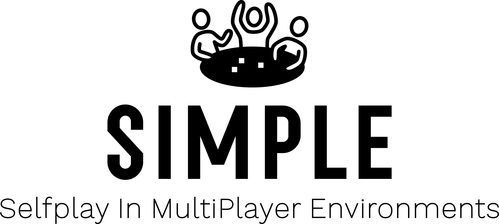
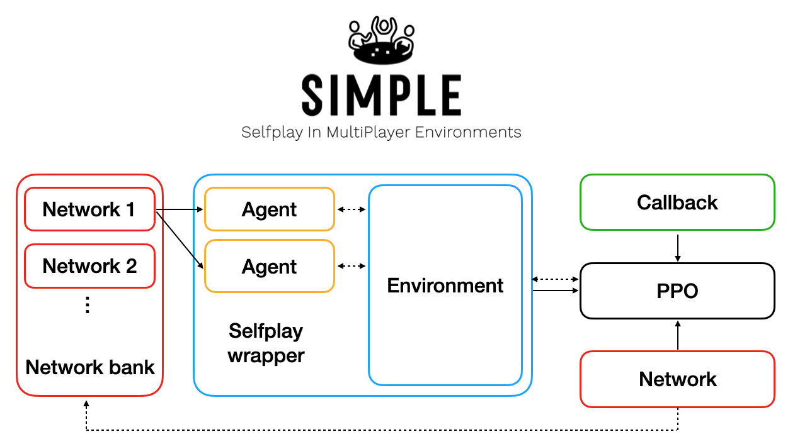

<!-- PROJECT SHIELDS -->
[![Contributors][contributors-shield]][contributors-url]
[![Forks][forks-shield]][forks-url]
[![Stargazers][stars-shield]][stars-url]
[![Issues][issues-shield]][issues-url]
[![MIT License][license-shield]][license-url]
[![LinkedIn][linkedin-shield]][linkedin-url]

<!-- PROJECT LOGO -->
<br />
<p align="center">
  <a href="https://github.com/davidADSP/SIMPLE">
    
  </a>

  <!-- <h3 align="center">SIMPLE</h3> -->

  <p align="center">
    Selfplay In MultiPlayer Environments
    <!-- <br /> -->
    <!-- <a href="https://github.com/davidADSP/SIMPLE"><strong>Explore the docs »</strong></a> -->
    <br />
    <!-- <a href="https://github.com/davidADSP/SIMPLE">View Demo</a> -->
    ·
    <a href="https://github.com/davidADSP/SIMPLE/issues">Report Bug</a>
    ·
    <a href="https://github.com/davidADSP/SIMPLE/issues">Request Feature</a>
  </p>
</p>
<br>


<!-- TABLE OF CONTENTS -->

  <summary><h2 style="display: inline-block">Table of Contents</h2></summary>
  <ol>
    <li>
      <a href="#about-the-project">About The Project</a>
    </li>
    <li>
      <a href="#getting-started">Getting Started</a>
      <ul>
        <li><a href="#prerequisites">Prerequisites</a></li>
        <li><a href="#installation">Installation</a></li>
      </ul>
    </li>
    <li><a href="#tutorial">Tutorial</a></li>
      <ul>
        <li><a href="#prerequisites">Quickstart</a></li>
        <li><a href="#prerequisites">Tensorboard</a></li>
        <li><a href="#custom-environments">Custom Environments</a></li>
        <li><a href="#parallelisation">Parallelisation</a></li>
      </ul>
    </li>
    <li><a href="#roadmap">Roadmap</a></li>
    <li><a href="#contributing">Contributing</a></li>
    <li><a href="#license">License</a></li>
    <li><a href="#contact">Contact</a></li>
    <li><a href="#acknowledgements">Acknowledgements</a></li>
  </ol>


<br>

---
<!-- ABOUT THE PROJECT -->
## About The Project



This project allows you to train AI agents on custom-built multiplayer environments, through self-play reinforcement learning.

It implements [Proximal Policy Optimisation (PPO)](https://openai.com/blog/openai-baselines-ppo/), with a built-in wrapper around the multiplayer environments that handles the loading and action-taking of opponents in the environment. The wrapper delays the reward back to the PPO agent, until all opponents have taken their turn. In essence, it converts the multiplayer environment into a single-player environment that is constantly evolving as new versions of the policy network are added to the network bank.

To learn more, check out the accompanying [blog post](https://medium.com/applied-data-science/how-to-train-ai-agents-to-play-multiplayer-games-using-self-play-deep-reinforcement-learning-247d0b440717).

This guide explains how to get started with the repo, add new custom environments and tune the hyperparameters of the system.

Have fun!

---
<!-- GETTING STARTED -->

## Getting Started

To get a local copy up and running, follow these simple steps.

### Prerequisites

Install [Docker](https://github.com/davidADSP/SIMPLE/issues) and [Docker Compose](https://docs.docker.com/compose/install/) to make use of the `docker-compose.yml` file

### Installation

1. Clone the repo
   ```sh
   git clone https://github.com/davidADSP/SIMPLE.git
   cd SIMPLE
   ```
2. Build the image and 'up' the container.
   ```sh
   docker-compose up -d
   ```
3. Choose an environment to install in the container (`tictactoe`, `connect4`, `sushigo`, `geschenkt`, `butterfly`, and `flamme rouge` are currently implemented)
   ```sh
   bash ./scripts/install_env.sh sushigo
   ```

---
<!-- TUTORIAL -->
## Tutorial

This is a quick tutorial to allow you to start using the two entrypoints into the codebase: `test.py` and `train.py`.

*TODO - I'll be adding more substantial documentation for both of these entrypoints in due course! For now, descriptions of each command line argument can be found at the bottom of the files themselves.*

---
<!-- QUICKSTART -->
### Quickstart

#### `test.py` 

This entrypoint allows you to play against a trained AI, pit two AIs against eachother or play against a baseline random model.

For example, try the following command to play against a baseline random model in the Sushi Go environment.
   ```sh
   docker-compose exec app python3 test.py -d -g 1 -a base base human -e sushigo 
   ```

#### `train.py` 

This entrypoint allows you to start training the AI using selfplay PPO. The underlying PPO engine is from the [Stable Baselines](https://stable-baselines.readthedocs.io/en/master/) package.

For example, you can start training the agent to learn how to play SushiGo with the following command:
   ```sh
   docker-compose exec app python3 train.py -r -e sushigo 
   ```

After 30 or 40 iterations the process should have achieved above the default threshold score of 0.2 and will output a new `best_model.zip` to the `/zoo/sushigo` folder. 

Training runs until you kill the process manually (e.g. with Ctrl-C), so do that now.

You can now use the `test.py` entrypoint to play 100 games silently between the current `best_model.zip` and the random baselines model as follows:

  ```sh
  docker-compose exec app python3 test.py -g 100 -a best_model base base -e sushigo 
  ```

You should see that the best_model scores better than the two baseline model opponents. 
```sh
Played 100 games: {'best_model_btkce': 31.0, 'base_sajsi': -15.5, 'base_poqaj': -15.5}
```

You can continue training the agent by dropping the `-r` reset flag from the `train.py` entrypoint arguments - it will just pick up from where it left off.

   ```sh
   docker-compose exec app python3 train.py -e sushigo 
   ```

Congratulations, you've just completed one training cycle for the game Sushi Go! The PPO agent will now have to work out a way to beat the model it has just created...

---
<!-- TENSORBOARD -->
### Tensorboard

To monitor training, you can start Tensorboard with the following command:

  ```sh
  bash scripts/tensorboard.sh
  ```

Navigate to `localhost:6006` in a browser to view the output.

In the `/zoo/pretrained/` folder there is a pre-trained `/<game>/best_model.zip` for each game, that can be copied up a directory (e.g. to `/zoo/sushigo/best_model.zip`) if you want to test playing against a pre-trained agent right away.

---
<!-- CUSTOM ENVIRONMENTS -->
### Custom Environments

You can add a new environment by copying and editing an existing environment in the `/environments/` folder.

For the environment to work with the SIMPLE self-play wrapper, the class must contain the following methods (expanding on the standard methods from the OpenAI Gym framework):

`__init__`

In the initiation method, you need to define the usual `action_space` and `observation_space`, as well as two additional variables: 
  * `n_players` - the number of players in the game
  * `current_player_num` - an integer that tracks which player is currently active
   

`step`

The `step` method accepts an `action` from the current active player and performs the necessary steps to update the game environment. It should also it should update the `current_player_num` to the next player, and check to see if an end state of the game has been reached.


`reset`

The `reset` method is called to reset the game to the starting state, ready to accept the first action.


`render`

The `render` function is called to output a visual or human readable summary of the current game state to the log file.


`observation`

The `observation` function returns a numpy array that can be fed as input to the PPO policy network. It should return a numeric representation of the current game state, from the perspective of the current player, where each element of the array is in the range `[-1,1]`.


`legal_actions`

The `legal_actions` function returns a numpy vector of the same length as the action space, where 1 indicates that the action is valid and 0 indicates that the action is invalid.


Please refer to existing environments for examples of how to implement each method.

You will also need to add the environment to the two functions in `/utils/register.py` - follow the existing examples of environments for the structure.

---
<!-- Parallelisation -->
### Parallelisation

The training process can be parallelised using MPI across multiple cores.

For example to run 10 parallel threads that contribute games to the current iteration, you can simply run:

  ```sh
  docker-compose exec app mpirun -np 10 python3 train.py -e sushigo 
  ```

---
<!-- ROADMAP -->
## Roadmap

See the [open issues](https://github.com/davidADSP/SIMPLE/issues) for a list of proposed features (and known issues).


---
<!-- CONTRIBUTING -->
## Contributing

Any contributions you make are **greatly appreciated**.

1. Fork the Project
2. Create your Feature Branch (`git checkout -b feature/AmazingFeature`)
3. Commit your Changes (`git commit -m 'Add some AmazingFeature'`)
4. Push to the Branch (`git push origin feature/AmazingFeature`)
5. Open a Pull Request


---
<!-- LICENSE -->
## License

Distributed under the GPL-3.0. See `LICENSE` for more information.


---
<!-- CONTACT -->
## Contact

David Foster - [@davidADSP](https://twitter.com/davidADSP) - david@adsp.ai

Project Link: [https://github.com/davidADSP/SIMPLE](https://github.com/davidADSP/SIMPLE)


---
<!-- ACKNOWLEDGEMENTS -->
## Acknowledgements

There are many repositories and blogs that have helped me to put together this repository. One that deserves particular acknowledgement is David's Ha's Slime Volleyball Gym, that also implements multi-agent reinforcement learning. It has helped to me understand how to adapt the callback function to a self-play setting and also to how to implement MPI so that the codebase can be highly parallelised. Definitely worth checking out! 

* [David Ha - Slime Volleyball Gym](https://github.com/hardmaru/slimevolleygym)

---
<!-- MARKDOWN LINKS & IMAGES -->
<!-- https://www.markdownguide.org/basic-syntax/#reference-style-links -->
[contributors-shield]: https://img.shields.io/github/contributors/davidADSP/SIMPLE.svg?style=for-the-badge
[contributors-url]: https://github.com/davidADSP/SIMPLE/graphs/contributors
[forks-shield]: https://img.shields.io/github/forks/davidADSP/SIMPLE.svg?style=for-the-badge
[forks-url]: https://github.com/davidADSP/SIMPLE/network/members
[stars-shield]: https://img.shields.io/github/stars/davidADSP/SIMPLE.svg?style=for-the-badge
[stars-url]: https://github.com/davidADSP/SIMPLE/stargazers
[issues-shield]: https://img.shields.io/github/issues/davidADSP/SIMPLE.svg?style=for-the-badge
[issues-url]: https://github.com/davidADSP/SIMPLE/issues
[license-shield]: https://img.shields.io/github/license/davidADSP/SIMPLE.svg?style=for-the-badge
[license-url]: https://github.com/davidADSP/SIMPLE/blob/master/LICENSE.txt
[linkedin-shield]: https://img.shields.io/badge/-LinkedIn-black.svg?style=for-the-badge&logo=linkedin&colorB=555
[linkedin-url]: https://linkedin.com/in/davidtfoster